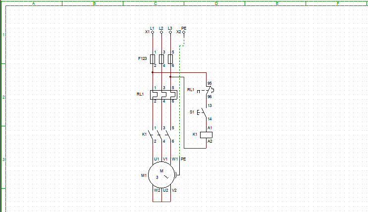
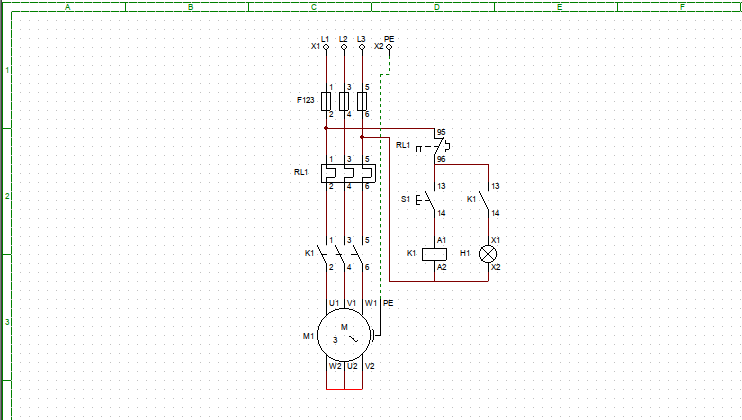

# IMD - ACIONAMENTOS

Esse repositório é destinado a apresentar formas de acionamentos de motores desenvolvidos durante as aulas da disciplina de Acionamentos Eletrônicos do Instituto Metropole Digital(IMD).

## Software

Os presentes circuitos foram desenvolvidos a partir da ferramenta de simulação: 
[CADe SIMU](https://www.cadesimu.net/)

Os arquivos colocados na pasta [Acionamentos](./Acionamentos) possuem extensão .cad que pode ser exportado para esse software.

## Acionamentos

Os acionamentos elaborados foram feitos para o acionamento direto de um motor trifasico YD.

### Partida direta

O acionamento de partida direta contém:
- **Circuito de força:** ligado a fonte de alimentação trifásica e ao motor. Contém dispositivos para proteção do motor - são os fusíveis e o relé de sobrecarga - e os contactores. Esse circuito pode ser identificado pela coluna C do diagrama.
- **Circuito de controle:** ligado as duas fases da alimentação trifásica. Contém um relé de sobrecarga para proteção, uma chave pulsante e uma bobina que servem para acionamento do circuito de força. Esse circuito pode ser identificado pela coluna D do diagrama

Enquanto chave pulsante **S1** permanecer pressionada, o motor estara funcionando. Ela energiza o circuito de controle e faz com que a bobina crie um campo magnético que feche o circuito de força pela atração dos contactores.

### Partida direta com sinalização

O acionamento seque a mesma lógica da partida direta, somente inclui uma sinalização que é feita quando o circuito de força é acionado pelo de controle.

Quando a chave **S1** é acionada, a bobina vai fechar tanto os contactores como também a chave que aciona da lâmpada **H1**, isso fará com que haja sinalização quando o motor estiver ligado.

### Partida direta com selo

A partida direta com selo acrescenta uma ligação chaveada do circuito de sinalização com o de controle que faz a alimentação da bobina bastanto apenas a ativação por uma única vez do botão **S1**.

Esse acionamento foi projeto para que não se precise manter a chave **S1** pressionada todo tempo para ligar o motor. Dessa forma, ela possui uma outra chave denominada **S2** que fica normalmente fechada, mas que quando ativada abre o circuito de controle e desliga o de força.

